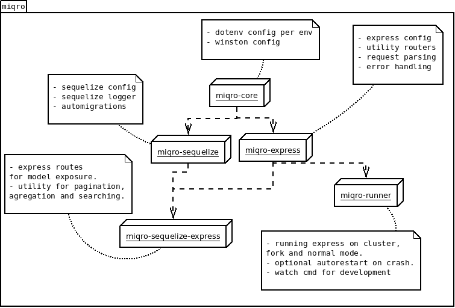

# miqro

**in early development not to use in production**

little framework for creating microservices with **express**, **sequelize** and **sequelize-auto-migrations**.

- database **auto-migration**.

- utilities for validating **requests** and creating routes that handle **sequelize** and **requests validating** errors and return usefull messages as a reply for faster development.

- utilities for creating services and routes for direct model **pagination**, **searching** and **agregation**.

- Utility route for validating tokens.

- runner with autorestart for cluster, fork and debug ( no autorestart in debug ).

- configuration for multiple enviroments using dotenv files.

- utility for FeatureToggling.

- **route->service->model** pattern base classes.

- project configuration for database and logging is **autogenerated** but can easily remove with the **cli** or overriden by just modifing the files ```config/db.js``` and ```config/log.js```.

- all project configuration, migrations, seeders and models are independant of **miqro** so you can **eject** your microservice easily from **miqro** and/or use another runner like **pm2**.

- exports type files for using miqro with **Typescript**. basic example on https://github.com/claukers/miqro-typescript


## posts.js

```javascript
const {
  ModelRoute,
  ModelService,
  Database,
  Util
} = require("miqro");

const logger = Util.getLogger("posts.js");
const db = Database.getInstance();

module.exports = async (app) => {
  /*
  * GET /post/
  * GET /post/:id
  * PATCH /post/:id
  * POST /post/
  * 
  * for model db.models.post
  * to allow delete add it to the allowedMethods list
  */
  app.use("/post",
    new ModelRoute(
      new ModelService(
        db.models.post
      ),
      {
        allowedMethods: ["GET", "POST", "PATCH"]
      }).routes());
  return app;
};
```

## quick setup

**NOTE**

there is a miqro base project with Typescript hosted at https://github.com/claukers/miqro-typescript

create a empty nodejs project.

```$ npm init``` 


```$ npm install --save miqro```

inits a miqro service configurations

```$ npx miqro-runner init posts.js```

**NOTE** this is only needed once

edit the main service file ```posts.js``` to look like this.

```javascript
const {
  ModelRoute,
  ModelService,
  Database,
  Util
} = require("miqro");

const logger = Util.getLogger("posts.js");
const db = Database.getInstance();

module.exports = async (app) => {
  /*
  * GET /post/
  * GET /post/:id
  * PATCH /post/:id
  * POST /post/
  * 
  * for model db.models.post
  * to allow delete add it to the allowedMethods list
  */
  app.use("/post",
    new ModelRoute(
      new ModelService(
        db.models.post
      ),
      {
        allowedMethods: ["GET", "POST", "PATCH"]
      }).routes());
  return app;
};
```

create a sequelize model file ```db/models/post.js```.

```javascript
'use strict';
module.exports = (sequelize, DataTypes) => {
  const post = sequelize.define('post', {
    url: {
      type: DataTypes.STRING,
      allowNull: false
    },
    name: {
      type: DataTypes.STRING,
      allowNull: false
    },
    valid: {
      type: DataTypes.BOOLEAN,
      allowNull: false
    }
  }, {});
  post.associate = (models) => {
  };
  return post;
};
```

now lets take care of the tables for the development database.

```npm install miqro-sequelize --save```

```node_modules/.bin/miqro-db automigrate posts.js```

**take notice that the last argument is the service script not a model in particular.**

**automigrate will run sequelize-automigrations and that will create migrations for creations, deletions or modifications of models created in the project and will try to apply them.**

**makemigrations and migrate commands also exists for doing this steps apart.**

finally lets review the newly generated dotenv configuration file for your **$NODE_ENV**( by default is **development** ) located in ```config/development.env```. This file holds the configuration environment variables miqro uses to configure every component like database and express. **Its is encouraged to load the passwords. secrets and other sensible information from a secret manager into the process.env.**

then start a node inspect/debug friendly mode.

```npx miqro-runner start posts.js```

or directly with node inspect 

```npm install miqro-runner --save-dev```

```node inspect node_modules/.bin/miqro-runner start posts.js```

**usefull for some IDE's with node debug support like VSCode**

You can also start the service in a cluster mode for better performance with the miqro runner.

example.

```npx miqro-runner start 4 cluster posts.js```

this will create 4 processes running your service in a node cluster.

## configuration

by default all configuration is done with env variables. You can load the env variables using the ```Util.loadConfig()``` call. This will load the correct **dotenv** file located in ```$MIQRO_DIRNAME/config/$NODE_ENV.env```. Calling ```Util.loadConfig()``` is not neccesary when using the **miqro runner**.

## request body parsing

by default body parser is used with the following options
```
BODYPARSER_INFLATE=true
BODYPARSER_LIMIT="100kb"
BODYPARSER_STRICT=true
BODYPARSER_TYPE="application/json"
```

you can change them in the appropiate dotenv file.

additionally miqro provides a **checkOptions** method that throws a ParserOptionError that is **automatically** handled by **ModelRoute**, **ServiceRoute**, **createAPIHandler** and **createServiceAPIHandler** routes. Also this utilities handle **sequelize** errors automatically.

an example usage of ```Util.parseOptions```.

```javascript
const { Util } = require("miqro");
...
const body = req.body;
const { name, id, aliases } = Util.parseOptions("body", body, [
  { name: "name", type: "string", required: true },
  { name: "id", type: "number", required: true }
  { name: "aliases", type: "array", arrayType: "string", required: false }
], "no_extra");
...
```

in case a the body doesnt pass the parseOptions function the route will return a **BadRequestResponse** with a message like ```body.name not a string!``` automatically.

## using miqro without the runner

you should be able to run your microservice without the miqro runner simply defining the ```MIQRO_DIRNAME``` env variable so that the components of **miqro** you are using will be able to **find** the config **dotenv files**.

the ```MIQRO_DIRNAME``` env variable must point to the parent folder of the ```config``` folder that contains the dotenv files.

like this.

```
$MIQRO_DIRNAME/config/development.env
```

then create a ```main.js``` creating a simple express server.
```javascript
const express = require("express");
const { Util, setupMiddleware } = require("miqro");
process.env.MIQRO_DIRNAME=__dirname;
Util.loadConfig();

const logger = Util.getLogger("main.js");
const service = require("./service.js");

const app = express();
setupMiddleware(app, logger);
service(app).then((server) => {
  server.listen(process.env.PORT);
}).catch((e) => {
  logger.error(e);
});
```

then run it

```node main.js```


## using the miqro runner

miqro has its own runner with auto-restart and can start your service in a **cluster**, **fork** or simple mode for debugging purposes.

first install the module

```npm install miqro-runner --save```

or as a dev deps if only you want it for development

```npm install miqro-runner --save-dev```

usage 

```miqro-runner start [nodes=1] [mode=simple] <microservice.js>```

example start in simple node

```miqro-runner start posts.js```

**simple mode is usefull for running the service in a debug environment like node inspect**

example start with 4 cluster nodes

```miqro-runner start 4 cluster posts.js```

example start in fork node

```miqro-runner start fork posts.js```

## stripping dendencies in your app



to provide all the features miqro depends on alot of modules. But there is a fix to this, the ```miqro``` module just exports all the features from other modules.


miqro's module ```index.ts```
```javascript
export * from "miqro-core";
export * from "miqro-sequelize";
export * from "miqro-express";
export * from "miqro-sequelize-express";
```

so if you dont want to use sequelize as your ORM or to have X as a dependency, instead of using the adding ```miqro``` to your application dependencies, you can use just the modules you want. For minimal support you can just use the ```miqro-core``` that just provides the bare bone minimals (app configuration per env and logger support via winston).

## database migrations

TODO

## sedding your database

TODO

## feature toggling

TODO

## documentation

TODO

## runner cli

```npm install miqro-runner --save```

```miqro-runner <command> [args..]```

```
usage: miqro-runner <command> [args]
Available commands:
	start	starts a microservice
	watch	starts a microservice in watch mode on the service dir.
	init	inits your config folder (MIQRO_DIRNAME)
	reset	delete custom made config files.
```

## db cli

```miqro-db <command> [args..]```

```
usage: miqro-db <command> [args]
Available commands:
	makemigrations	seeks changes in your models and creates migrations
	migrate	runs the migrations
	automigrate	runs makemigrations and migrate together
	seed	seeds your db
```
